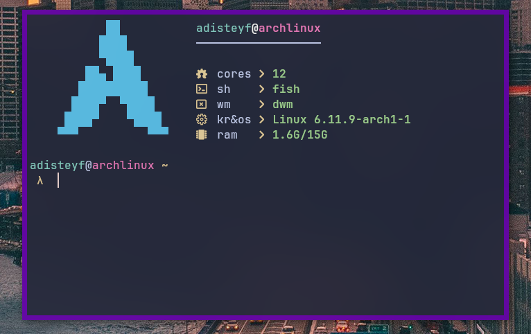

# Adifetch

Just a simple fetch on **C** with customization.

Example of default fetch:

## Installation

### Non-recomended

1. `git clone https://github.com/shawarmateam/adifetch.git`.
2. `cp src/config.def.h src/config.h`.
3. `sudo make clean install`.

### Recomended

>![WARNING]
> adkPKG in beta-test.

1. `adkpkg get -g adifetch`.
2. `adkpkg install adifetch`.
